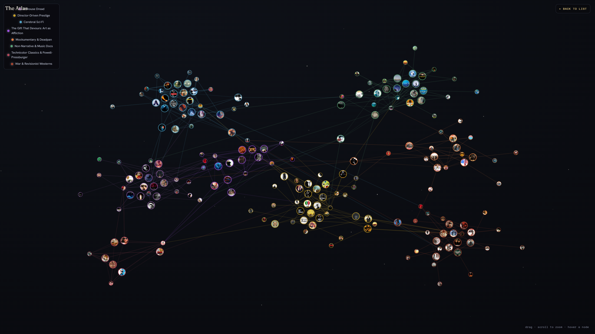
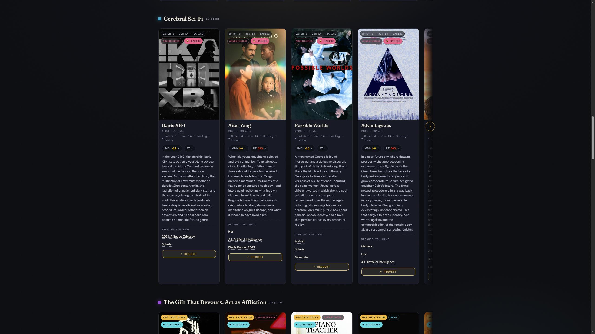

# Claude Code Movie Recommender

A [Claude Code](https://claude.com/claude-code) skill **for Plex servers** that turns your library into a
living **recommendation atlas**: it scans what you own on Plex, researches the web for titles you'd love but
don't have, ties every pick back to something on your shelf (with a one-line *why*), and publishes a rich
HTML page plus an **interactive proximity map** where closeness encodes taste.

It's **stateful** — each run diffs your library against the last, learns from what you actually added
(previous picks you acquired are a strong "more like this" signal), evolves your taste profile, and
**appends** a new round of recommendations instead of overwriting the old ones.

> **Built for Plex.** It reads your Plex library over the Plex API (with optional Tautulli for per-user tabs
> and Overseerr/Jellyseerr for availability + requests). The library backend is pluggable (`library.source`),
> but Plex is the implemented and supported one. Everything installation-specific lives in one config file,
> so the repo stays generic and shareable.



## What it produces
- **`index.html`** — recommendation cards grouped into taste regions (swipeable carousels). Each card: poster,
  title/year, full overview, IMDb + Rotten Tomatoes links, *because you have …* links with a one-line why, a
  freshness badge (which run produced it), and — with Seerr — a live availability badge + one-click request.
- **`map.html`** — a full-screen constellation: every pick and its library anchors as nodes; proximity =
  similarity; edges = the "because you have X" links.
- **Per-user tabs** (optional, via Tautulli) — a personalized tab per Plex user, driven by their watch
  history. Selecting a user's tab **re-renders the atlas to just their picks** (and the titles they anchor
  to); "Everyone" restores the library-wide map.
- **`data.json`** — the single data file both pages read (schema: [`references/data-schema.md`](references/data-schema.md)).



## How it works
```
scan library → diff vs last run → profile taste → [synthesize a discovery cluster] → research the web
           → enrich (posters/ratings) → explain each link → lay out the map → publish
```
Each stage is a small, reusable prompt (`prompts/01`–`08`) with a strict JSON contract; deterministic Python
scripts handle scanning, diffing, assembly, and deploy; a Workflow script (`scripts/pipeline.workflow.js`)
fans the research out in parallel.

## Requirements
- **Python 3** — standard library only, no pip packages to install.
- **A Plex server** to read — the one hard dependency.
- **[Claude Code](https://claude.com/claude-code)** to run the skill; the Workflow tool drives the parallel
  research (without it, you can run the `prompts/` by hand).
- Optional: a **TMDB API key** (richer posters/metadata), **Tautulli** (per-user tabs),
  **Overseerr/Jellyseerr** (live availability + one-click requests), and an SVG rasterizer
  (`rsvg-convert` / Inkscape / ImageMagick) to emit a PNG social-card image. D3 loads from a CDN.

## Install
Drop this directory in your Claude Code skills folder so it's discoverable as `/recommendations`:
```bash
git clone https://github.com/RealRogerWinter/claude-plex-movie-recommender ~/.claude/skills/recommendations
```

## Configure
Nothing personal is committed. Copy the example config and edit it:
```bash
mkdir -p ~/.config/recommendations
cp ~/.claude/skills/recommendations/config.example.json ~/.config/recommendations/config.json
python3 ~/.claude/skills/recommendations/scripts/config.py show   # inspect the merged config
```
Every field is documented in **[`references/configuration.md`](references/configuration.md)** (resolution
order, env overrides, and how tokens/keys are read at runtime — they're never stored).

## Integrations (all optional except Plex)
The skill needs one thing: a library to read. Everything else degrades gracefully — see
**[`references/integrations.md`](references/integrations.md)**.

| Integration | Adds | If absent |
|---|---|---|
| **Plex** (required) | the library to scan + posters | nothing runs |
| **Tautulli** | a personalized tab per user (watch history) | library-wide recs only |
| **Seerr** (Overseerr/Jellyseerr) | live availability + one-click request & auto-approve | no availability/request UI |
| **TMDB key** | faster, higher-quality posters/metadata | best-effort public posters |
| **Deploy** | publish the static site | preview locally only |

## Run
```bash
cd ~/.claude/skills/recommendations
WD=~/recommendations
python3 scripts/scan_library.py --workdir $WD     # snapshot the library
python3 scripts/track_state.py  --workdir $WD     # diff vs last run, reconcile the ledger
# generate this round's picks via scripts/pipeline.workflow.js (Claude Code Workflow), then:
python3 scripts/build_site.py   --workdir $WD --append $WD/work/recommendations.json
python3 scripts/serve.py        --dir $WD/site    # preview at http://localhost:8000
```

> **Just want to see the UI?** No Plex needed — run `python3 scripts/serve.py --dir assets/templates`, then
> open `http://localhost:8000/index.html?data=data.sample.json` to render the bundled sample data.

### Daring & Discovery modes
Two optional flags reshape a run (set `modes.*` in config, or pass `daring: true` / `discovery: true` in the
pipeline args):
- **daring** — pushes past the safe zone: deeper cuts, festival/international, older and formally bold picks.
- **discovery** — first *synthesizes a brand-new taste cluster* from your library's genre trends (a novel
  intersection it doesn't already have), then researches it.

Tag the build with `--mode daring` / `--mode discovery` so the round is labelled and cards are badged. After a
bold run, **`scripts/analyze_runs.py`** tables every target × mode (availability, era, *anchor novelty*, thin
picks) so you can see whether it actually explored new ground — the measurement half of the feedback loop.

## The feedback loop
`scan` records everything found; `track_state` diffs it against last time. Titles you **added** become taste
signal; any that match a prior recommendation are marked **acquired** (a strong "more of this"). Prompt
`07-evolve-preferences` folds the diff into your profile so each round explores **new** ground, and the site's
"Since last time" panel surfaces the system learning. Recommendations **accumulate** across rounds — a run
filter and freshness badges let you see which round produced each pick.

## Publish
The build is a self-contained static site. See **[`references/deploy.md`](references/deploy.md)** for GitHub
Pages, Cloudflare (Pages / Tunnel with a Basic-Auth gate), or any static host — including how to wire the
Seerr request proxy. Publishing is public; treat the first publish — and any DNS change — as a deliberate,
confirm-first step. Keep your generated `site/` (personal data) out of any repo you intend to open-source; the
**skill source is the generic, shareable part**.

## Project layout
```
prompts/        01–08 — classify · taste · research · enrich · explain · map · evolve · discovery
references/      configuration.md · integrations.md · deploy.md · data-schema.md · research-sources.md
scripts/         config · plexlib · scan_library · track_state · build_site · seerr · tautulli
                 request_proxy · analyze_runs · serve · deploy.sh · pipeline.workflow.js
assets/templates/  index.html · map.html · app.css · render.js · map.js · logo.svg · og.svg · favicon.svg
docs/              README screenshots
README.md · config.example.json · SKILL.md · LICENSE
```

## Credits & acknowledgements
- Metadata & posters from **[The Movie Database (TMDB)](https://www.themoviedb.org/)**.
  *This product uses the TMDB API but is not endorsed or certified by TMDB.*
- Recommendations are triangulated across editorial lists and community sources — Letterboxd, Trakt,
  TasteDive, Reddit, JustWatch, IMDb, Rotten Tomatoes (see
  [`references/research-sources.md`](references/research-sources.md)).
- Constellation rendered with **[D3](https://d3js.org/)**; type is **Fraunces**, **Hanken Grotesk**, and
  **Space Mono** via Google Fonts.
- A skill for **[Claude Code](https://claude.com/claude-code)**.

Not affiliated with or endorsed by Plex, TMDB, Overseerr/Jellyseerr, or Tautulli. All film/TV titles,
posters, and trademarks belong to their respective owners.

## License
[MIT](LICENSE).
